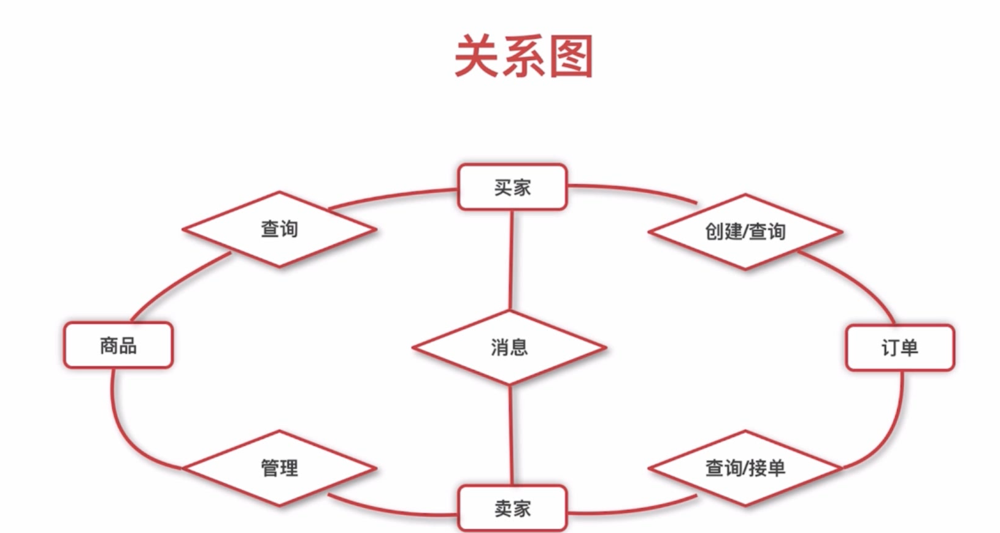
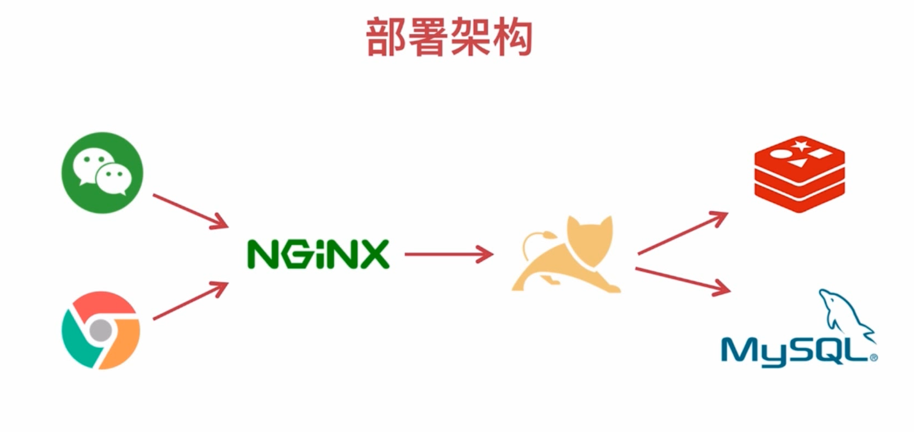
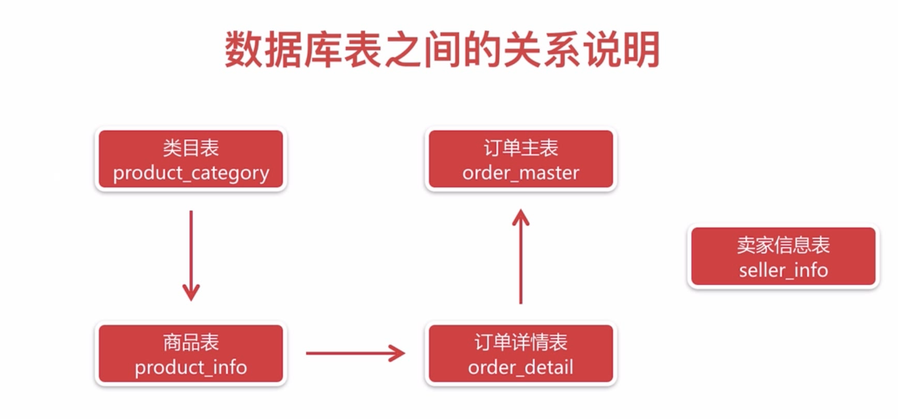
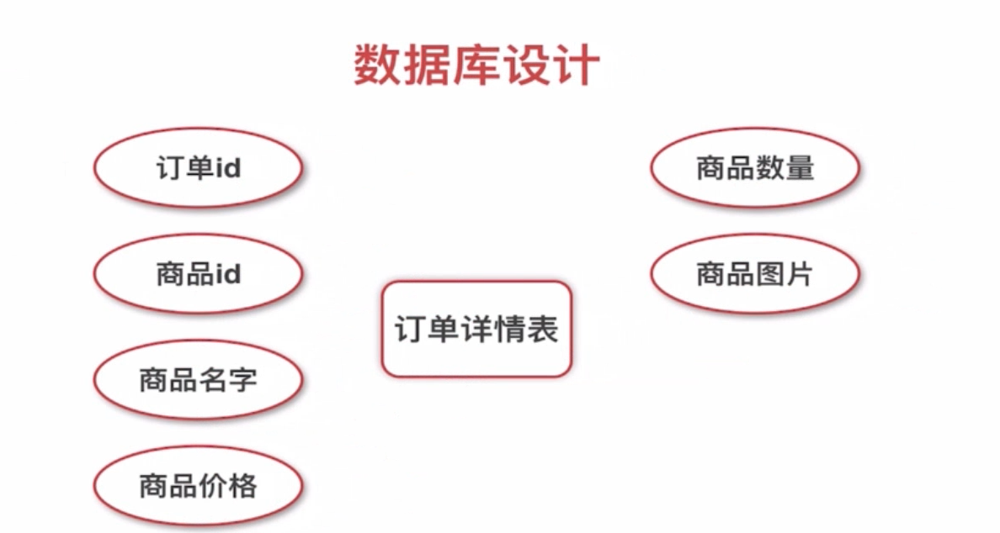

# 微信点餐系统

### 一、项目设计
- 角色划分
- 功能模块划分
- 部署架构

1. 角色划分
- 买家（手机端）
- 卖家（PC 端）
2. 功能分析
- 商品
  - 商品列表
- 订单
  - 订单创建
  - 订单查询
  - 订单取消
- 类目
  - 订单管理
  - 商品管理
  - 类目管理

3. 关系图

4. 部署架构

二、架构和基础框架
单一应用架构 -》 垂直应用架构 -》 分布式服务架构 -》 流动计算架构

- 两大“门派”
  - 阿里系
    - Duboo
    - Zookeeper
    - springMVC or SpringBoot
  - Spring Cloud 栈
    - Spring Cloud
    - Netflix Eureka
    - SpringBoot

三、数据库表之间的关系说明
- 表和表之间的关系
- 建表SQL
- 注意事项

### 部署
mvn clean package -Dmaven.test.skip=true